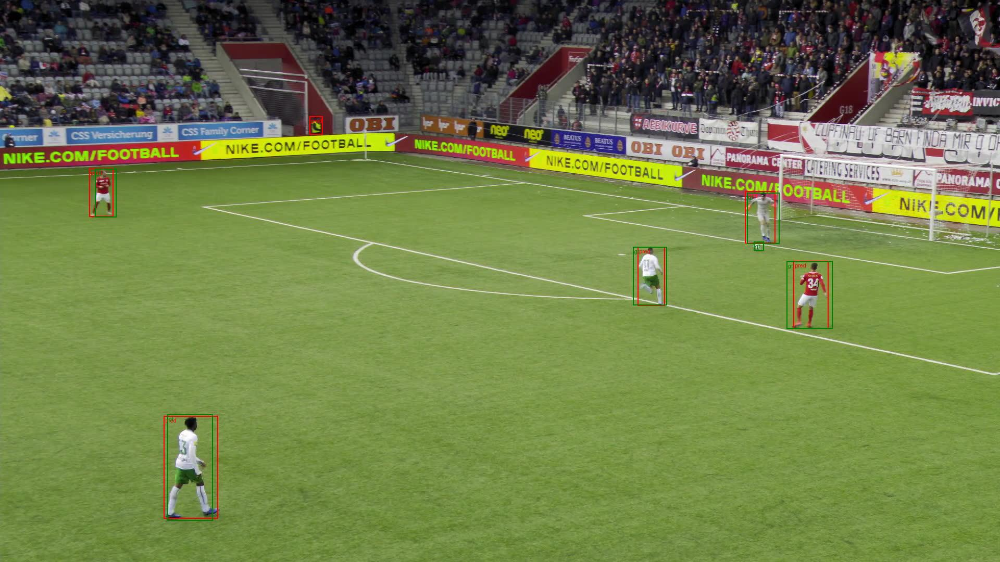
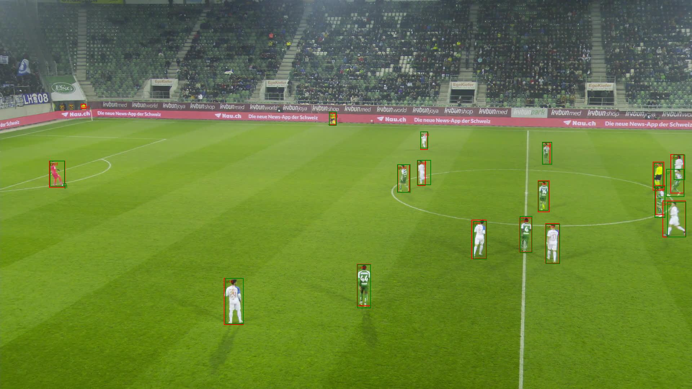

# Project Structure

## *First* `python download_data.py` -- Gives us soccernet_data

## pretrainedFasterRCNNExperiments
- Contains baseline benchmarks with various score thresholds
- Contains finetuned model benchmarks with various score thresholds
- Contains sample images from multiple runs

## pretrainedYOLOExperiments
- Contains baseline benchmarks with various score thresholds
- Contains finetuned model training with ROBOFLOW Data, and soccernet data
-   `python process_soccernet.py [soccernet_data dir] ` transforms soccernet_data into YOLO format for finetuning with SoccerNet data
- condense_yolo_soccernet -- eliminates 20 all but 20 frames from yolo format data for quicker benchmarking
- Contains sample images from multiple runs
- `FinetunedYOLORun` contains figures from benchmarking

## fasterRCNNArchitectureExperiments
- exp1: Experiments with backbones, dissecting Inception V3 feature extractor
- exp2: Feature size effects on anchor points for bounding bounding boxes
- exp3: Ground truth manipulation
- exp4 folder: Investigating how scale and ratio of bounding boxes result in higher or lower identifications, first attempts with region proposal network
[text](blob:vscode-webview%3A//16p3uibtapbug296usup8gldi8j7atrvgceoqpkfsi87seoabf02/c01c17fb-7c8f-4f03-b8ae-8cf879dacd8d)
## customFasterRCNN
- Adapting: https://medium.com/data-science/understanding-and-implementing-faster-r-cnn-a-step-by-step-guide-11acfff216b0 with far more challenging dataset, updated backbone, gpu acceleration, checkpoints, lr schedulers etc on Discovery.

[text](blob:vscode-webview%3A//16p3uibtapbug296usup8gldi8j7atrvgceoqpkfsi87seoabf02/c3dc527a-113f-4c4a-b312-7af979eae4c4)[text](blob:vscode-webview%3A//16p3uibtapbug296usup8gldi8j7atrvgceoqpkfsi87seoabf02/4be3561c-95d1-478c-8101-8eee4a478c14)[text](blob:vscode-webview%3A//16p3uibtapbug296usup8gldi8j7atrvgceoqpkfsi87seoabf02/579737a9-0312-42c9-a022-6032ac4bb233)